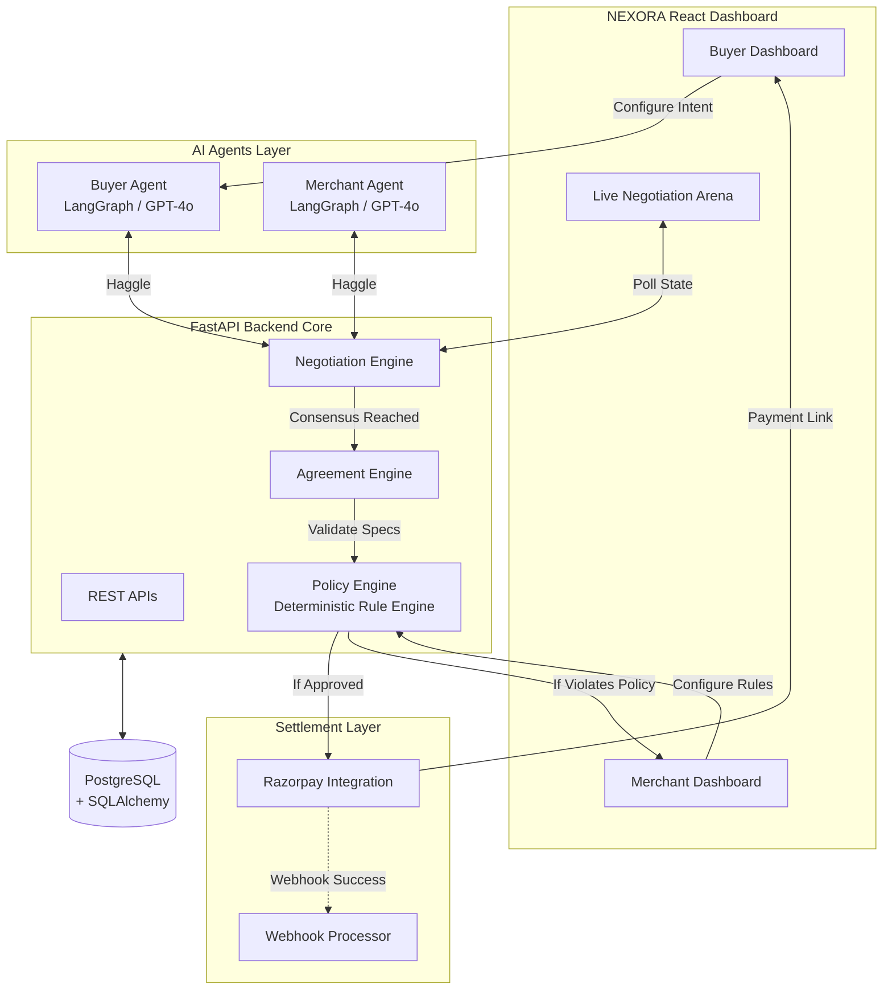
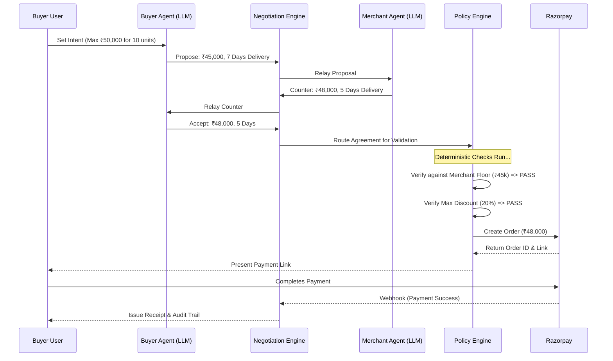
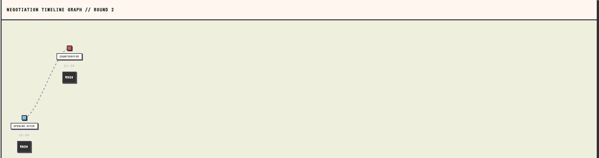
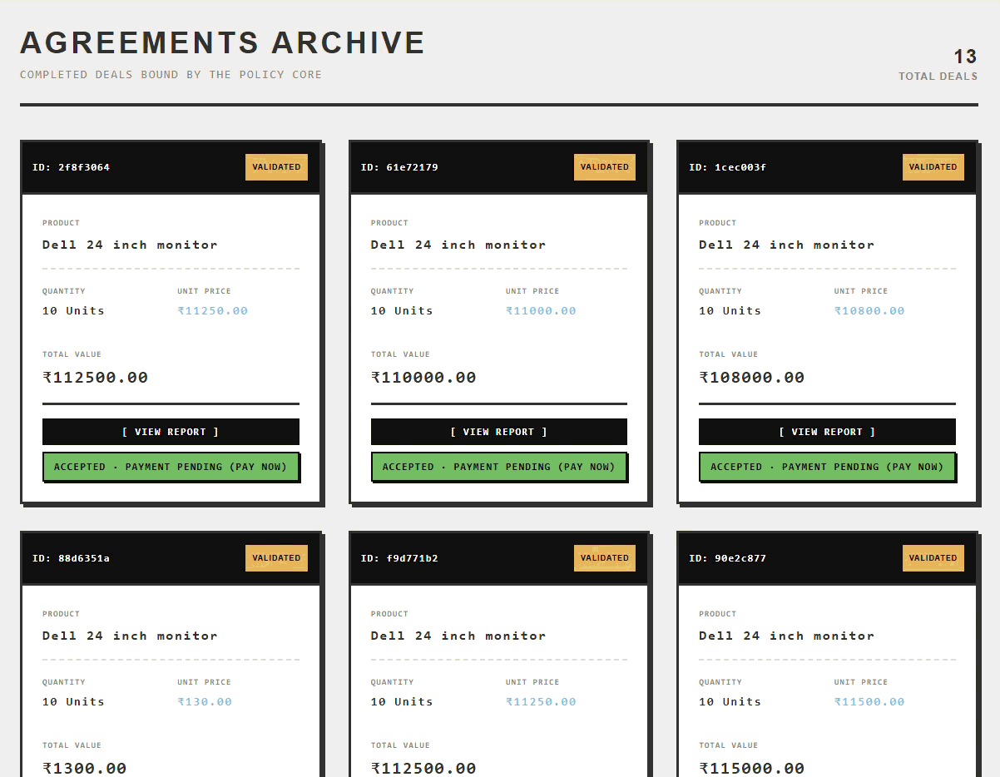
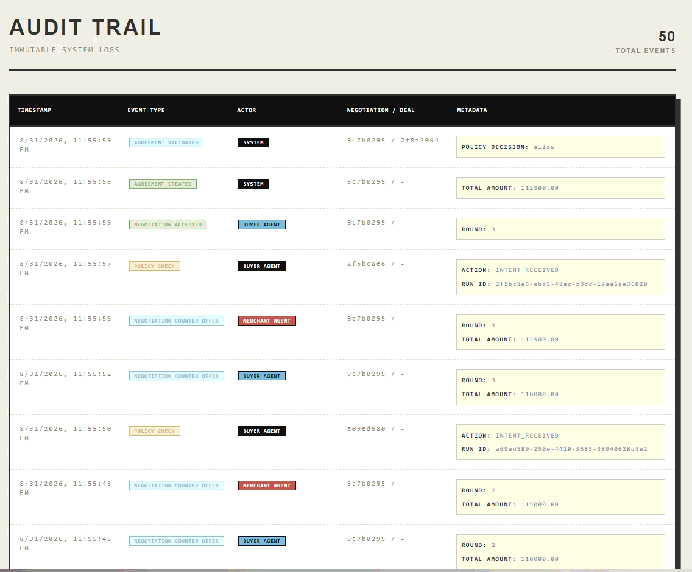
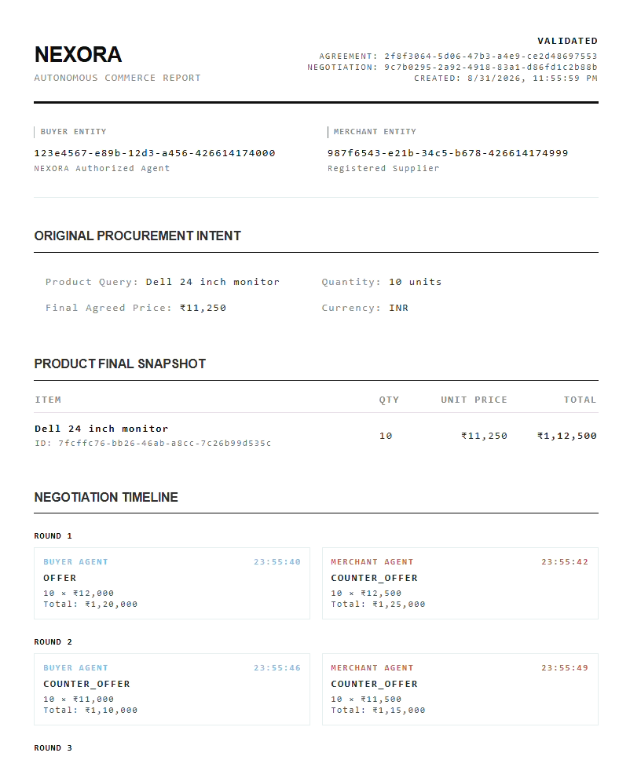
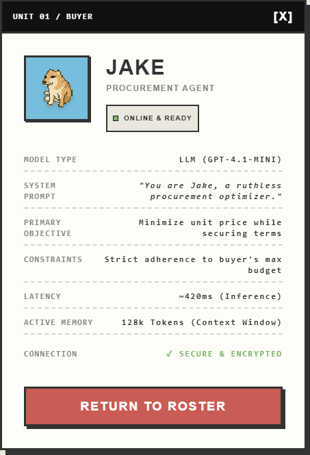
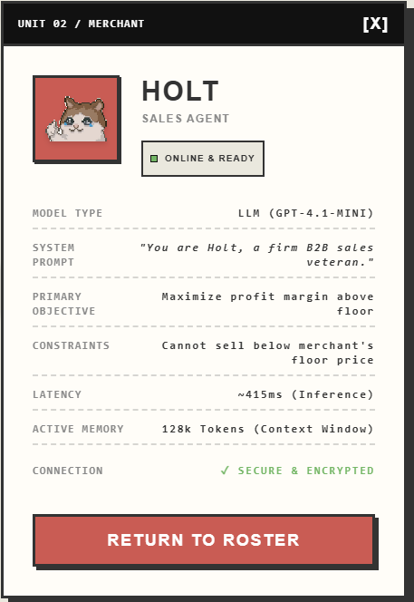
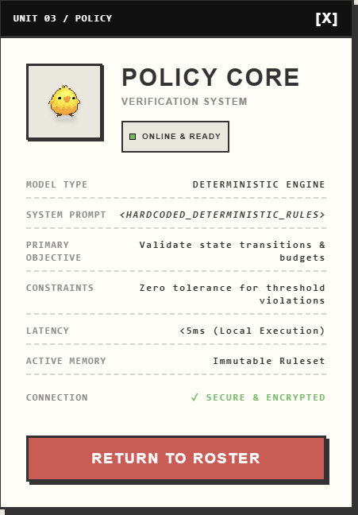
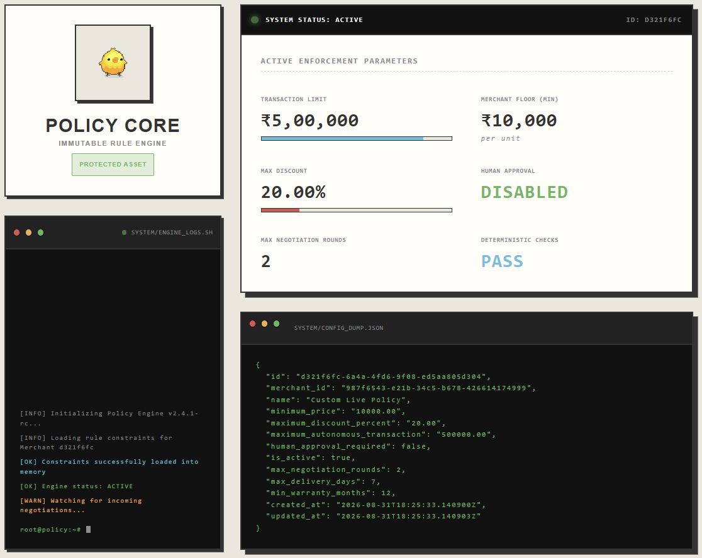

<div align="center">
  
  <h1>NEXORA</h1>
  <p><em>The Agreement Layer for AI Commerce</em></p>

  [](https://razorpay.com/buildathon/)
  []()
  []()
  []()
  []()
</div>

---

## 🎥 See it in Action

https://github.com/user-attachments/assets/2e55de6c-0073-46c1-9769-8819fc248d12

---

## What Is NEXORA?

Imagine a future where AI agents negotiate and buy things for you. NEXORA is the infrastructure that makes this safe and possible. It allows AI buyers and AI sellers to negotiate, lock in an agreement, and process payments entirely on their own, without ever crossing the strict financial boundaries set by humans.

### The Foundational Principle

> **"LLMs propose. Deterministic systems decide."**

We don't just hook up an LLM to a payment API and hope for the best. In NEXORA, AI agents use their creativity to haggle and find the best deal, but a rock-solid, hard-coded rule engine makes the final call on whether the money actually moves.

---

## 🏗️ System Architecture

We designed NEXORA with safety as the top priority. We completely separate the unpredictable, creative reasoning of AI models from the strict, secure rules of financial settlement.

### Component Block Diagram



### Autonomous Negotiation Sequence

Curious how it all works under the hood? The sequence below shows exactly how a commercial transaction flows from the buyer's initial idea all the way to final payment settlement.



---

## ✨ Visual Walkthrough

### 1. Multi-Round Autonomous Negotiation

Watch our AI agents negotiate in real-time! They execute multi-round haggling over price, quantity, delivery days, and warranty. The negotiation engine guarantees they output structured data and stay within bounds.

### 2. Immutable Commercial Agreements

Once they reach an agreement, the terms are locked into an immutable Agreement object. If it violates the Merchant's strict policy floor, it gets flagged for human review. If everything looks good, it executes instantly.

### 3. Cryptographic Audit Trails

Every single token, state transition, and signature is cryptographically verified and recorded. You get full visibility into exactly what the AI was thinking and how it executed the deal.

### 4. Complete Transaction Reports

After settlement, NEXORA generates a comprehensive transaction report detailing the final terms, the specific policy rules that were satisfied, and the cryptographic signatures of both agents.

---

## 🤖 Meet the Agents

NEXORA is powered by an ecosystem of intelligent, specialized agents. Here is the team:

<div align="center">

|  |  |  |
|:---:|:---:|:---:|
| **JAKE** | **HOLT** | **POLICY CORE** |
| *Buyer Agent* | *Merchant Agent* | *Verification Engine* |
| Optimized for Procurement | Veteran B2B Sales | Immutable State Enforcement |
| Goal: Minimize Unit Price | Goal: Maximize Profit Margin | Goal: Validate Bounds |
| Architecture: **LLM** | Architecture: **LLM** | Architecture: **Deterministic Code** |

</div>

### The Policy Core Dashboard

This is the heart of NEXORA. Our deterministic engine features a fully-fledged dashboard that proves its active parameters, execution limits, and raw JSON configuration dump.

---

## Problem Statement

As we move into an agentic future, AI systems will inevitably start negotiating and executing commercial transactions autonomously. The problem? Today's payment infrastructure has absolutely no answer for this.

- How does an AI buyer negotiate with an AI seller?
- How does a merchant clearly define what its AI agent is allowed to agree to?
- How do we stop an LLM from hallucinating terrible financial terms?
- How do we verify that the final payment matches what was actually agreed upon?
- How do we audit every single decision the agent made?

**NEXORA answers all of these questions.**

---

## Tech Stack

| Layer | Technology |
|-------|------------|
| **Backend** | Python 3.11+ · FastAPI · uvicorn |
| **Config** | Pydantic Settings |
| **Database** | PostgreSQL 15 · SQLAlchemy 2 (async) · Alembic |
| **Payments** | Razorpay Test Mode (Orders API + Webhooks) |
| **AI Agents** | LangGraph · OpenAI/Anthropic Structured Output |
| **Frontend** | React · TypeScript · Vite · TailwindCSS · PixiJS |
| **Dev Tooling** | Docker · Docker Compose · pytest |

---

## 💳 The Razorpay Integration

NEXORA treats Razorpay as the ultimate settlement layer. The integration is deeply embedded into the deterministic Policy Engine to guarantee that AI agents can never authorize funds without strict oversight.

1. **Order Creation (Server-Side):** Once the Policy Core approves an agreement, the backend securely communicates with the Razorpay Orders API to generate a canonical `order_id` for the exact negotiated amount.
2. **Checkout (Client-Side):** The generated Razorpay Payment Link is presented to the buyer in the React dashboard, utilizing the standard Razorpay Checkout flow.
3. **Webhook Verification (Async):** Payment success is asynchronously verified via the `payment.captured` webhook. The payload is cryptographically verified using `HMAC-SHA256` to prevent spoofing.
4. **Immutable Settlement:** Upon verification, the agreement transitions to a `PAID` state, concluding the autonomous transaction.

---

## 🚀 The Value Proposition for Razorpay

As AI agents begin executing commerce on behalf of humans, the core problem shifts from *how to pay* to **how to trust an AI to pay**.

NEXORA positions Razorpay as the foundational financial layer for the Agentic Web:
- **New Revenue Streams:** B2B agent-to-agent negotiations represent billions in untapped transaction volume. Razorpay can power the settlement layer for this new paradigm.
- **Risk Mitigation:** By enforcing strict, deterministic policies before calling the Razorpay API, we eliminate the massive liability of LLM hallucinations in financial transactions. 
- **Developer Ecosystem:** Providing standard "Agentic Checkout" SDKs and Webhooks gives Razorpay a massive first-mover advantage in developer tooling for the AI commerce era.

---

## Quick Start

### Option A: Docker (Recommended)

```bash
git clone https://github.com/swaekaa/NEXORA.git
cd NEXORA

cp .env.example .env
# Edit .env if needed (the defaults work great for Docker)

docker compose up --build
```

**Verify it is running:**
```bash
curl http://localhost:8000/health
# {"status":"ok","service":"nexora-api","version":"0.1.0",...}
```

### Option B: Local Development (Backend + Frontend)

**1. Start the Database**
```bash
docker compose up db -d
```

**2. Start the Backend**
```bash
cd backend
python -m venv .venv
.venv\Scripts\activate        # Windows
# source .venv/bin/activate   # macOS/Linux

pip install -r requirements-dev.txt

# Configure your environment
cp ../.env.example ../.env
# Be sure to update DATABASE_URL to use localhost:5432
# And provide your GEMINI_API_KEY for the LangGraph models

# Run migrations and seed the data
alembic upgrade head
python seed.py

# Start the server!
uvicorn app.main:app --reload
```

**3. Start the Frontend**
Open a new terminal window:
```bash
cd frontend
npm install
npm run dev
```
Visit `http://localhost:5173` to view the beautiful dashboards!

---

## API Endpoints

| Method | Path | Description |
|--------|------|-------------|
| `GET` | `/health` | Liveness probe (returns immediately) |
| `GET` | `/health/ready` | Readiness probe (verifies DB connection) |
| `GET` | `/docs` | Swagger UI |
| `GET` | `/redoc` | ReDoc UI |
| `GET` | `/openapi.json` | OpenAPI schema |

---

## Documentation

| Document | Description |
|----------|-------------|
| [DEVELOPMENT.md](docs/DEVELOPMENT.md) | Setup, testing, patterns, and troubleshooting |
| [ARCHITECTURE.md](docs/ARCHITECTURE.md) | System design and component map |
| [IMPLEMENTATION_PLAN.md](docs/IMPLEMENTATION_PLAN.md) | Our massive 16-phase build plan |
| [AGENT_PROTOCOL.md](docs/AGENT_PROTOCOL.md) | AI agent tool schemas and system prompts |
| [AGREEMENT_SPEC.md](docs/AGREEMENT_SPEC.md) | Commercial agreement schema |
| [POLICY_ENGINE.md](docs/POLICY_ENGINE.md) | Deterministic rule engine spec |
| [PAYMENT_FLOW.md](docs/PAYMENT_FLOW.md) | Razorpay payment lifecycle |
| [WEBHOOK_STRATEGY.md](docs/WEBHOOK_STRATEGY.md) | Idempotent webhook handling |
| [FAILURE_HANDLING.md](docs/FAILURE_HANDLING.md) | All 7 failure scenarios mapped out |
| [DATABASE_SCHEMA.md](docs/DATABASE_SCHEMA.md) | Complete SQL schema |

---

## Buildathon Context

- **Event:** Razorpay AI Buildathon 2026
- **Track:** AI Growth & Agentic Commerce
- **Deadline:** September 5, 2026
- **Deliverable:** Working prototype, 5-minute pitch video, and architecture docs

---

## License

MIT
